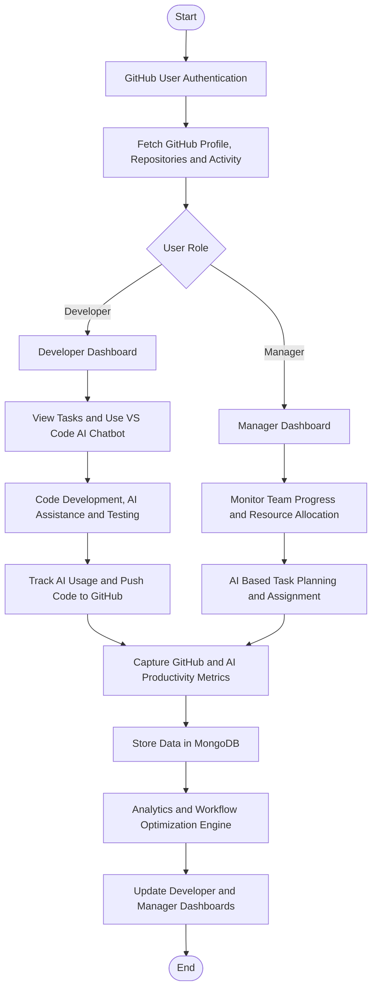

# X Code: AI-Powered Engineering Workflow & Resource Optimization System

## Problem Statement Alignment

X Code is designed to address the core requirements of the AI-Powered Engineering Workflow & Resource Optimization System by combining GitHub integration with a custom VS Code AI chatbot to structure development workflows, monitor developer productivity, track AI usage, and improve task allocation.

---

## System Overview

X Code is an AI-driven engineering management platform that focuses on:

- Structuring the software development lifecycle  
- Capturing detailed development metrics  
- Monitoring GitHub-based developer productivity  
- Tracking AI usage through a custom VS Code chatbot  
- Dynamically allocating tasks  
- Providing real-time dashboards for managers and developers  

---

## 1. Workflow Engine

The system organizes development into structured phases:

### Planning → Development → Testing → Feedback

### Implementation:
- GitHub tracks repository progress, commits, project members, and contribution history  
- Custom VS Code chatbot captures AI interactions during coding and AI-assisted contribution  
- Tasks are broken into small, manageable units  
- AI is integrated as a collaborative assistant in project handling  

---

## 2. Data Capture Layer

### GitHub Integration
GitHub is used to authenticate users and capture:
- User profile details  
- Repository access  
- Commit history  
- Contribution frequency  
- Code activity  
- Project participation  

### Custom VS Code AI Chatbot
The chatbot monitors AI usage during development by capturing:
- AI prompts used  
- Token consumption  
- AI-generated code contribution  
- Session count  
- AI-assisted productivity metrics  

### Captured Metrics:
- Time spent per task  
- Developer productivity  
- AI usage and effectiveness  
- Work sessions  
- Contribution tracking  

---

## 3. Allocation Engine

Task assignment is dynamically handled using:
- Current workload  
- GitHub contribution history  
- Skill compatibility  
- Past performance  
- AI efficiency  

### Purpose:
- Balance workloads  
- Prevent overloading  
- Improve resource utilization  
- Increase productivity  

---

## 4. Analytics Dashboard

### Manager Dashboard:
- Project progress  
- Team productivity  
- Resource utilization  
- Risk indicators  
- Bottlenecks  
- AI contribution  

### Developer Dashboard:
- Personal commits  
- Task status  
- Productivity metrics  
- AI usage  
- Performance insights  

---

## System Architecture

### Frontend:
- Next.js  
- React  
- Tailwind CSS  

### Backend:
- GitHub OAuth Authentication  
- GitHub API Integration  
- Custom VS Code Chatbot  
- Task Allocation Engine  
- Analytics Engine  

### Database:
- MongoDB  

### Core Data Stored:
- User profiles  
- GitHub activity  
- Task records  
- AI chatbot logs  
- Productivity analytics  

---

## Database Design / Schema

### Main Collections:
- **Users:** Profile, role, GitHub authentication, skillset  
- **Developers:** Productivity, workload, AI efficiency  
- **Projects:** Project details, team members, deadlines  
- **Tasks:** Task breakdown, assignment, priority, status  
- **GitHub Metrics:** Commits, PRs, contribution history  
- **AI Usage Logs:** Prompts, tokens, AI code contribution  
- **Activity Logs:** Sessions, updates, workflow actions  
- **Analytics Reports:** Productivity trends, bottlenecks, task recommendations  

---

### System Architecture Diagram


---

## Sample Dataset and Allocation Strategy

X Code uses GitHub activity, task records, productivity metrics, and AI usage logs as operational datasets for real-time monitoring and workflow analysis. This data is not used for ML training; instead, an NLP-based model analyzes developer skills, task requirements, and project context to support intelligent task allocation and workflow optimization.

---

## AI Integration Strategy

AI in X Code acts as a collaborative assistant that supports developers through the VS Code chatbot with coding help, debugging, and productivity tracking, while also assisting managers with task planning, workflow optimization, and resource allocation. It monitors prompts, token usage, AI-generated contribution, and performance metrics to improve overall engineering efficiency without replacing human decision-making.

### AI Responsibilities:
- Assist coding through VS Code chatbot  
- Track AI usage  
- Measure token and prompt consumption  
- Monitor AI-generated contribution  
- Support workflow decisions  


## Final Objective Achieved

X Code improves:
- Developer productivity  
- Task allocation efficiency  
- Resource optimization  
- Code quality visibility  
- AI effectiveness measurement  
- Project decision-making  

---

## Getting Started

### 1. Prerequisites
- Node.js 18+  
- MongoDB running locally or on Atlas  
- Gemini API Key  

### 2. Environment Setup
Create a `.env.local` file in the root directory and add the following:

```env
MONGODB_URI=mongodb://localhost:27017
MONGODB_DB=xcode_db
GITHUB_CLIENT_ID=your_client_id
GITHUB_CLIENT_SECRET=your_client_secret
GITHUB_OAUTH_CALLBACK_URL=http://localhost:3000/api/auth/github
GEMINI_API_KEY=your_gemini_api_key
```

### 3. Installation & Running the Web App
```bash
npm install
npm run dev
```

### 4. VS Code Extension Setup
```bash
cd vscode-extension
npm install
npm run compile
```

- Open the `vscode-extension` folder in VS Code  
- Press `F5` to launch a new VS Code window with the extension enabled  
- Use the **X Code** icon in the Activity Bar to access the assistant  

---
